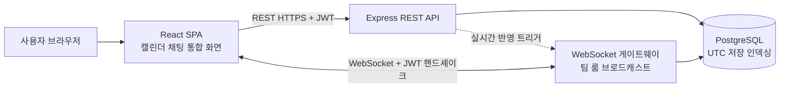
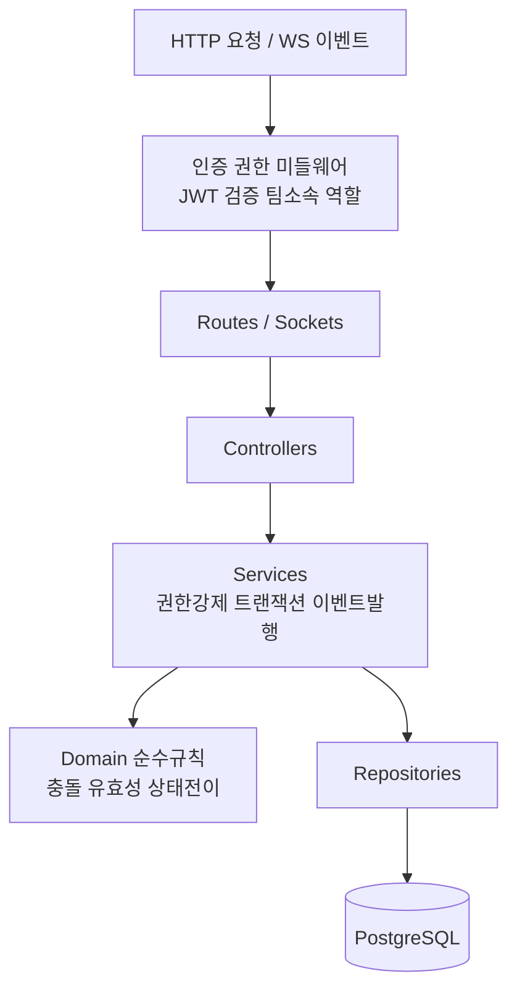
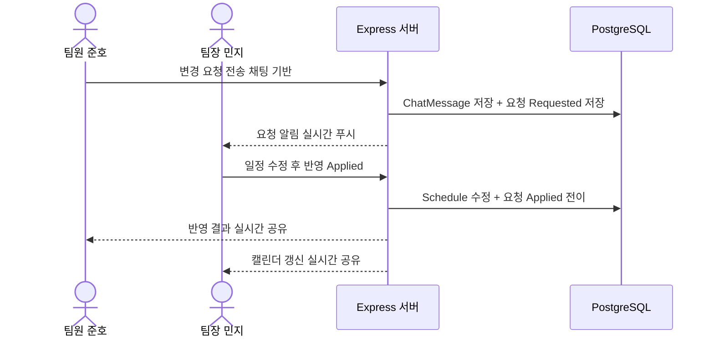
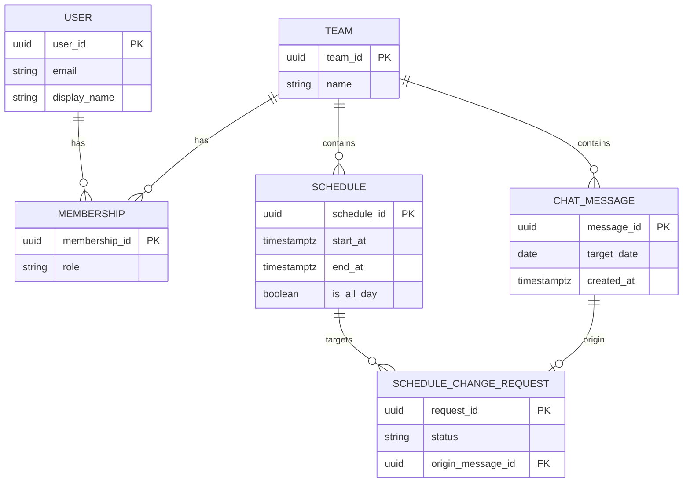
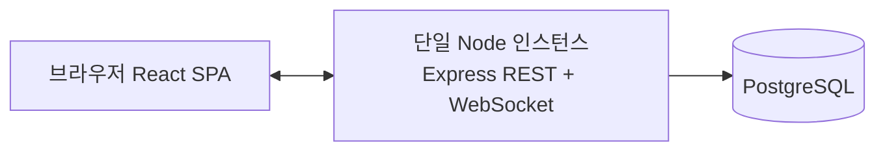

# Team CalTalk 기술 아키텍처 다이어그램

## 0. 문서 메타데이터

| 항목 | 내용 |
|---|---|
| 제품명 | Team CalTalk |
| 문서명 | 기술 아키텍처 다이어그램 |
| 버전 | v0.1 |
| 상태 | Draft |
| 작성일 | 2026-06-02 |
| 작성자 | mansik87@gmail.com |
| 관련 문서 | `docs/1-domain-definition.md` (도메인 정의서 v0.2), `docs/2-PRD.md` (PRD v0.1), `docs/3-user-scenarios.md` (사용자 시나리오 v0.1), `docs/4-project-structure-principles.md` (프로젝트 구조 설계 원칙 v0.1) |
| 문서 목적 | Team CalTalk MVP의 기술 아키텍처를 다이어그램 중심으로 한눈에 파악할 수 있도록, 시스템 구성·백엔드 레이어·핵심 흐름·데이터 모델·배포 구성을 단순하게 시각화한다. |

---

## 1. 개요

Team CalTalk은 **웹 우선 React SPA**, **Node.js + Express API 서버**, **PostgreSQL**로 구성된 단일 인스턴스 MVP 아키텍처다. 클라이언트는 일반 요청·조회는 **REST(HTTPS)** 채널로, 채팅과 일정·변경요청의 실시간 반영은 **WebSocket(socket.io) 채널**로 통신하며, WebSocket은 **팀 단위 룸(room)** 으로 브로드캐스트한다. 인증은 **JWT 무상태 토큰**을 사용하여 REST 요청과 WebSocket 핸드셰이크 양쪽에서 검증하고, 권한 매트릭스는 서버측에서 강제한다. 백엔드는 Routes/Sockets → Controllers → Services(+순수 Domain 규칙) → Repositories → DB의 단방향 레이어로 구성되며, 모든 일시는 **UTC로 저장**하고 표시 시 사용자 시간대로 변환한다. Redis pub/sub 기반 다중 인스턴스 확장은 MVP 범위에 포함하지 않고 구조만 선반영한다.

---

## 2. 시스템 구성도

브라우저(React SPA) ↔ Express 서버(REST + WebSocket) ↔ PostgreSQL의 최상위 구성이다. 인증(JWT)은 두 채널 모두에서 검증되며, 실시간 반영은 팀 룸 브로드캐스트로 이루어진다.

- REST 채널: 인증, 팀/멤버십, 일정 CRUD, 변경요청 처리 등 요청·응답.
- WebSocket 채널: 채팅 송수신, 일정·변경요청 변경의 실시간 푸시(동일 팀 룸).
- 두 채널 모두 JWT를 검증하고, 서버에서 팀 소속·역할 권한을 강제한다.

---

## 3. 백엔드 레이어 구조

의존성은 항상 안쪽(Domain)을 향하는 단방향이다. 횡단 관심사인 인증/권한 미들웨어는 요청 경계에서 한 번 처리된다.

- 미들웨어: JWT 인증(BR-01), 팀 소속·역할 권한(BR-02/BR-03), 입력 검증을 레이어에 흩뿌리지 않고 경계에서 처리.
- Services: 비즈니스 규칙이 사는 곳. 권한 강제, 도메인 이벤트 발행, 유스케이스 흐름 조율.
- Domain: I/O 없는 순수 함수(BR-06 유효성, BR-07 충돌 판정, BR-09 상태 전이).
- Repositories: 파라미터라이즈드 쿼리와 행↔도메인 매핑만 담당.

---

## 4. 핵심 흐름 시퀀스 (SC-05)

가장 대표적인 핵심 차별점 흐름이다. 팀원이 채팅으로 일정 변경을 요청하고(Requested), 팀장이 일정을 수정해 반영(Applied)하면 결과가 실시간으로 팀에 공유된다.

- ChatMessage의 messageId가 originMessageId로 변경요청에 연결되어 "왜 바뀌었는가"의 근거가 보존된다(North Star Metric, 연결률 100%).
- 반영 시 서버는 충돌 검사(BR-07)를 재수행하고, 상태를 Requested → Applied로 전이(BR-09, AC-07)한 뒤 팀 룸으로 브로드캐스트한다.

---

## 5. 데이터 모델 관계 (간단 ER)

핵심 엔티티와 주요 관계만 표현한다. 모든 컬럼이 아니라 식별·연결에 필요한 핵심 속성만 포함한다.

- Membership이 User와 Team을 연결하며, role(`team_leader`/`team_member`)로 권한을 판정한다(BR-10).
- ScheduleChangeRequest는 대상 Schedule을 참조하고, originMessageId로 근거 ChatMessage에 연결된다(BR-04).
- start_at/end_at/created_at은 UTC(timestamptz), target_date는 달력 날짜로 구분 저장한다(NFR-05).

---

## 6. 배포 구성 (MVP)

단일 서버 인스턴스가 REST와 WebSocket을 함께 제공하고, 하나의 PostgreSQL 인스턴스를 사용한다.

> 향후 확장: 다중 인스턴스로 수평 확장 시 Redis pub/sub로 팀 룸 브로드캐스트를 다중 인스턴스에 전파한다(NFR-02, MVP 미포함, 구조만 선반영).

---

## 7. 참고 / 정합 노트

| 다이어그램 | 정합 근거 |
|---|---|
| 2. 시스템 구성도 | PRD 9장 기술 스택·구성도, WebSocket 권장 근거, JWT 무상태 인증(REST+WS 핸드셰이크 검증). 구조 원칙 5.3 팀 룸 브로드캐스트. |
| 3. 백엔드 레이어 구조 | 구조 원칙 2.1 레이어(Routes/Sockets→Controllers→Services/Domain→Repositories→DB), 단방향 의존, 횡단 관심사 미들웨어 분리. BR이 사는 곳(Service/Domain). |
| 4. 핵심 흐름 시퀀스 | 시나리오 SC-05(UC-04/UC-05, FR-08/FR-09, BR-04/BR-09, AC-07), originMessageId 연결과 North Star Metric. |
| 5. 데이터 모델 ER | 도메인 정의서 4장 엔티티·관계, 구조 원칙 3.1 DB 테이블/컬럼 네이밍, NFR-05 UTC 저장. |
| 6. 배포 구성 | PRD 13장 가정(단일 인스턴스 시작, 확장 구조만 선반영), 향후 확장(Redis pub/sub). 구조 원칙 P8. |
