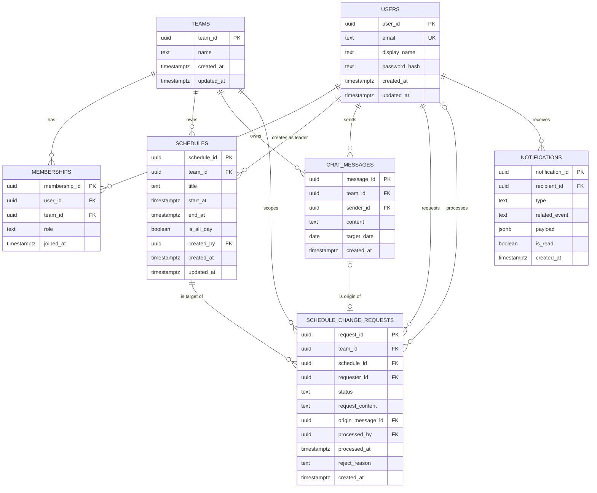

# Team CalTalk ERD (데이터 모델)

## 0. 문서 메타데이터

| 항목 | 내용 |
|---|---|
| 제품명 | Team CalTalk |
| 문서명 | Team CalTalk ERD / 데이터 모델 |
| 버전 | v0.1 |
| 상태 | Draft |
| 작성일 | 2026-06-02 |
| 관련 문서 | `docs/1-domain-definition.md` (도메인 정의서 v0.2), `docs/2-PRD.md` (제품 요구사항 정의서 v0.1) |

---

## 1. 개요

본 문서는 도메인 정의서 4장의 7개 핵심 엔티티(User, Team, Membership, Schedule, ChatMessage, ScheduleChangeRequest, Notification)를 **PostgreSQL 15/16** 기준의 관계형 데이터 모델로 구체화한 ERD다. 모든 일시(`timestamptz`)는 **UTC로 저장**하고 표시 시 사용자 시간대로 변환하며(NFR-05), 달력상 날짜는 `date`, 종일 여부는 `boolean`으로 표현한다. 기본키는 `uuid`(`gen_random_uuid()`)를 사용하고, 충돌 판정(BR-07)·일자별 채팅 이력(Daily Chat Log)·권한 판정 등 핵심 조회 경로에 복합 인덱스를 부여하여 3,000팀 동시 운영(NFR-02)의 구조적 토대를 확보한다. 도메인 규칙(BR-06/09/10 등)은 CHECK·UNIQUE 제약과 FK로 DB 수준에서 강제한다.

---

## 2. ERD 다이어그램 (Mermaid erDiagram)

> 카디널리티 요약: `USERS 1:N MEMBERSHIPS`, `TEAMS 1:N MEMBERSHIPS`(Membership이 User↔Team 연결), `TEAMS 1:N SCHEDULES / CHAT_MESSAGES / SCHEDULE_CHANGE_REQUESTS`, `SCHEDULES 1:N SCHEDULE_CHANGE_REQUESTS`, `CHAT_MESSAGES 1:0..1 SCHEDULE_CHANGE_REQUESTS`(origin_message_id — 변경요청의 채팅 근거, 핵심 차별점), `USERS 1:N SCHEDULE_CHANGE_REQUESTS`(요청자), `USERS 0:N SCHEDULE_CHANGE_REQUESTS`(처리자, nullable), `USERS 1:N NOTIFICATIONS`(대상 사용자).

---

## 3. 엔티티별 상세

### 3.1 users (DM-User)

| 컬럼 | 타입 | 제약/설명 |
|---|---|---|
| user_id | uuid | PK, NOT NULL, DEFAULT `gen_random_uuid()` |
| email | text | NOT NULL, **UNIQUE** (계정 식별, FR-01) |
| display_name | text | NOT NULL, 표시이름 |
| password_hash | text | NOT NULL, bcrypt/argon2 해시만 저장(NFR-04, 평문 미저장) |
| created_at | timestamptz | NOT NULL, DEFAULT `now()` (UTC) |
| updated_at | timestamptz | NOT NULL, DEFAULT `now()` (UTC) |

### 3.2 teams (DM-Team)

| 컬럼 | 타입 | 제약/설명 |
|---|---|---|
| team_id | uuid | PK, NOT NULL, DEFAULT `gen_random_uuid()` |
| name | text | NOT NULL, 팀명 |
| created_at | timestamptz | NOT NULL, DEFAULT `now()` (UTC), 생성일 |
| updated_at | timestamptz | NOT NULL, DEFAULT `now()` (UTC) |

### 3.3 memberships (DM-Membership)

| 컬럼 | 타입 | 제약/설명 |
|---|---|---|
| membership_id | uuid | PK, NOT NULL, DEFAULT `gen_random_uuid()` |
| user_id | uuid | FK → users.user_id, NOT NULL |
| team_id | uuid | FK → teams.team_id, NOT NULL |
| role | text | NOT NULL, **CHECK** `role IN ('team_leader','team_member')` (역할 유일성, BR-10 / 권한 SSOT 5장) |
| joined_at | timestamptz | NOT NULL, DEFAULT `now()` (UTC), 가입일 |

> **UNIQUE(user_id, team_id)**: 한 팀 내 한 사용자는 단일 멤버십·단일 역할만 가진다(BR-10).

### 3.4 schedules (DM-Schedule)

| 컬럼 | 타입 | 제약/설명 |
|---|---|---|
| schedule_id | uuid | PK, NOT NULL, DEFAULT `gen_random_uuid()` |
| team_id | uuid | FK → teams.team_id, NOT NULL (충돌 판정·조회 범위) |
| title | text | NOT NULL, 제목 |
| start_at | timestamptz | NOT NULL (UTC) |
| end_at | timestamptz | NOT NULL (UTC) |
| is_all_day | boolean | NOT NULL, DEFAULT `false` (종일 여부; 충돌 시 반열린 구간 정규화, BR-07) |
| created_by | uuid | FK → users.user_id, NOT NULL, 작성자(팀장, BR-03) |
| created_at | timestamptz | NOT NULL, DEFAULT `now()` (UTC) |
| updated_at | timestamptz | NOT NULL, DEFAULT `now()` (UTC) |

> **CHECK** `start_at < end_at` (일정 유효성, BR-06 / AC-04). 동일·역전 값 거부.

### 3.5 chat_messages (DM-ChatMessage)

| 컬럼 | 타입 | 제약/설명 |
|---|---|---|
| message_id | uuid | PK, NOT NULL, DEFAULT `gen_random_uuid()` |
| team_id | uuid | FK → teams.team_id, NOT NULL |
| sender_id | uuid | FK → users.user_id, NOT NULL, 작성자 |
| content | text | NOT NULL, 본문 |
| target_date | date | NOT NULL, **대상 날짜** — Daily Chat Log 그룹핑 키(도메인 4.1/4.2, BR-05) |
| created_at | timestamptz | NOT NULL, DEFAULT `now()` (UTC), **생성시각** — 작성 물리 시각, 불변(도메인 4.1) |

> `target_date`(맥락 날짜)와 `created_at`(작성 시각)을 명확히 분리한다(도메인 4.1).

### 3.6 schedule_change_requests (DM-ScheduleChangeRequest)

| 컬럼 | 타입 | 제약/설명 |
|---|---|---|
| request_id | uuid | PK, NOT NULL, DEFAULT `gen_random_uuid()` |
| team_id | uuid | FK → teams.team_id, NOT NULL (요청 목록 범위) |
| schedule_id | uuid | FK → schedules.schedule_id, NOT NULL, 대상 일정 |
| requester_id | uuid | FK → users.user_id, NOT NULL, 요청자(팀원, BR-04) |
| status | text | NOT NULL, DEFAULT `'requested'`, **CHECK** `status IN ('requested','applied','rejected')` (상태 전이, BR-09 / 6.2) |
| request_content | text | NOT NULL, 요청 내용 |
| origin_message_id | uuid | FK → chat_messages.message_id, NOT NULL, **변경요청 근거 메시지**(핵심 차별점, FR-08 originMessageId) |
| processed_by | uuid | FK → users.user_id, **NULL 허용**, 처리자(팀장); requested 상태에서는 NULL |
| processed_at | timestamptz | **NULL 허용** (UTC), 처리 시각 |
| reject_reason | text | **NULL 허용**, 반려 사유(선택, OI-7 미결) |
| created_at | timestamptz | NOT NULL, DEFAULT `now()` (UTC) |

> 종결 상태(applied/rejected)는 재전이하지 않으며, 처리(applied/rejected)는 팀장만 수행한다(6.2, AC-08). `origin_message_id`는 "Applied 변경 100%에 채팅 근거 연결" KPI를 위해 NOT NULL로 둔다(PRD 4장).

### 3.7 notifications (DM-Notification)

| 컬럼 | 타입 | 제약/설명 |
|---|---|---|
| notification_id | uuid | PK, NOT NULL, DEFAULT `gen_random_uuid()` |
| recipient_id | uuid | FK → users.user_id, NOT NULL, 대상 사용자 |
| type | text | NOT NULL, 유형(예: conflict_warning, change_shared 등) |
| related_event | text | NOT NULL, 발생 도메인 이벤트명(예: ScheduleConflictDetected, 도메인 7장) |
| payload | jsonb | NULL 허용, 이벤트 페이로드(scheduleId, requestId 등) |
| is_read | boolean | NOT NULL, DEFAULT `false`, 읽음 여부 |
| created_at | timestamptz | NOT NULL, DEFAULT `now()` (UTC), 발생시각 |

---

## 4. 인덱스 전략 (NFR-02)

| 인덱스 | 대상 컬럼 | 목적 / 관련 |
|---|---|---|
| ux_users_email | users(email) | 로그인 식별, 이메일 유일성 (FR-01) |
| ux_memberships_user_team | memberships(user_id, team_id) **UNIQUE** | 역할 유일성·소속/권한 판정 (BR-10, BR-02) |
| ix_memberships_team | memberships(team_id) | 팀별 멤버 조회 |
| ix_schedules_team_time | schedules(team_id, start_at, end_at) | **충돌 판정**(BR-07)·기간 범위 조회·캘린더 뷰 (NFR-02) |
| ix_chat_messages_team_date | chat_messages(team_id, target_date) | **Daily Chat Log** 일자별 조회 (BR-05, 도메인 4.2) |
| ix_chat_messages_team_created | chat_messages(team_id, created_at) | 실시간 채팅 시간순 정렬 (FR-07) |
| ix_scr_team_status | schedule_change_requests(team_id, status) | 변경요청 목록(Requested 필터) (FR-09) |
| ix_scr_schedule | schedule_change_requests(schedule_id) | 일정별 변경요청 추적 |
| ix_scr_origin_message | schedule_change_requests(origin_message_id) | 채팅 근거 연결 추적 (PRD 핵심 차별점) |
| ix_notifications_recipient_read | notifications(recipient_id, is_read) | 미읽음 알림 조회 (도메인 7장) |

---

## 5. 제약 조건 및 무결성 규칙

### 5.1 FK 삭제 정책 (ON DELETE, MVP 관점)

| FK | 정책 제안 | 근거 |
|---|---|---|
| memberships.user_id / team_id | **CASCADE** | 사용자/팀 삭제 시 소속 관계 정리 |
| schedules.team_id | **CASCADE** | 팀 삭제 시 팀 일정 정리 |
| schedules.created_by | **RESTRICT** | 작성 이력 보전(작성자 무단 삭제 방지) |
| chat_messages.team_id | **CASCADE** | 팀 삭제 시 채팅 정리 |
| chat_messages.sender_id | **RESTRICT** | 작성 이력 보전 |
| schedule_change_requests.team_id / schedule_id | **CASCADE** | 팀·대상 일정 삭제 시 정리 |
| schedule_change_requests.origin_message_id | **RESTRICT** | 변경 근거 메시지 보존(핵심 차별점) |
| schedule_change_requests.requester_id / processed_by | **RESTRICT** / NULL 허용 | 요청·처리 이력 보전 |
| notifications.recipient_id | **CASCADE** | 사용자 삭제 시 알림 정리 |

> MVP 기준 제안이며, 감사(audit) 요구가 명확해지면 RESTRICT 범위를 확대하거나 soft-delete를 도입한다.

### 5.2 CHECK / UNIQUE / 저장 원칙

- **CHECK** memberships.role ∈ {team_leader, team_member}
- **CHECK** schedule_change_requests.status ∈ {requested, applied, rejected}
- **CHECK** schedules: `start_at < end_at`
- **UNIQUE** users(email), memberships(user_id, team_id)
- **UTC 저장**: 모든 `timestamptz`는 UTC로 저장하고 분 단위로 충돌 비교, 표시 시 사용자 시간대로 변환(NFR-05, BR-07)

### 5.3 도메인 규칙 ↔ DB 제약 매핑

| 도메인 규칙(BR) | DB 제약 |
|---|---|
| BR-06 일정 유효성 (start < end) | schedules CHECK `start_at < end_at` |
| BR-07 충돌 판정 | schedules(team_id, start_at, end_at) 인덱스 + 애플리케이션 판정식(저장은 차단 안 함, BR-08) |
| BR-09 변경요청 상태 전이 | schedule_change_requests.status CHECK + 애플리케이션 전이 가드(종결 불변) |
| BR-10 역할 유일성 | memberships role CHECK + UNIQUE(user_id, team_id) |
| BR-01/BR-02 인증·소속 전제 | memberships로 소속 판정(서버측 권한 강제, NFR-04) — DB 직접 제약 아님 |
| BR-05 일자별 이력 보존 | chat_messages.target_date NOT NULL + 인덱스 |

> 충돌 판정(BR-07)·상태 전이 가드(BR-09)·권한(BR-01/02/03)은 등가성·경계·종결 규칙이 DB 단일 제약으로 환원되지 않으므로, **DB 제약 + 서버 애플리케이션 로직**으로 이중 보장한다.

---

## 6. 설계 노트 / 가정

- **Daily Chat Log는 테이블이 아니다.** 동일 팀의 `chat_messages`를 `target_date`로 그룹핑한 조회 관점(read view)이며, 별도 엔티티/테이블을 두지 않는다(도메인 4.2). 필요 시 `chat_messages(team_id, target_date)` 인덱스 기반의 SQL 뷰로 노출한다.
- **Notification 보존 범위**는 세션 한정 vs 영속이 미결(OI-5)이다. 본 모델은 영속 저장 전제로 테이블을 두되, 정책 확정 시 보존 기간·정리(purge) 전략을 추가한다.
- **reject_reason**의 필수/선택 여부는 미결(OI-7)이다. 도메인상 선택이므로 본 모델은 NULL 허용으로 둔다.
- **PK는 uuid 채택.** bigserial 대비 추측 곤란성·다중 인스턴스/분산 친화성으로 3,000팀 확장 구조(NFR-02, 무상태 JWT·수평 확장 방향)와 정합하여 uuid(`gen_random_uuid()`)를 채택한다.
- **created_by 역할 강제는 애플리케이션 책임이다.** schedules.created_by가 해당 팀의 team_leader인지는 FK만으로 보장되지 않으므로, 서버측 권한 매트릭스(도메인 5장, BR-03)에서 강제한다.
- **origin_message_id는 NOT NULL.** 변경요청은 항상 채팅 메시지를 매개로 발생한다는 핵심 차별점(PRD 2·4장, FR-08)을 반영하여 근거 메시지 연결을 필수화한다.
